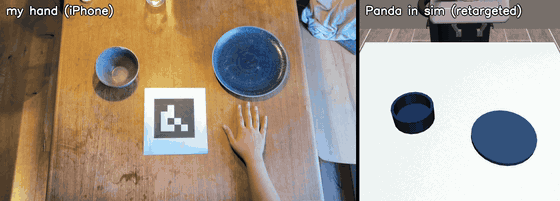
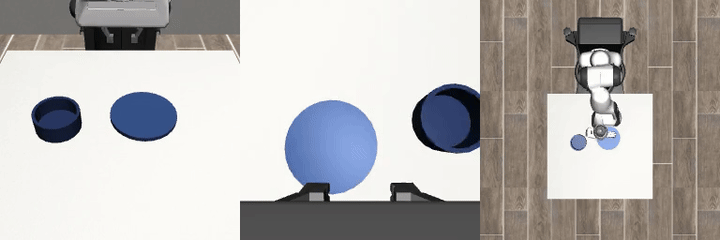
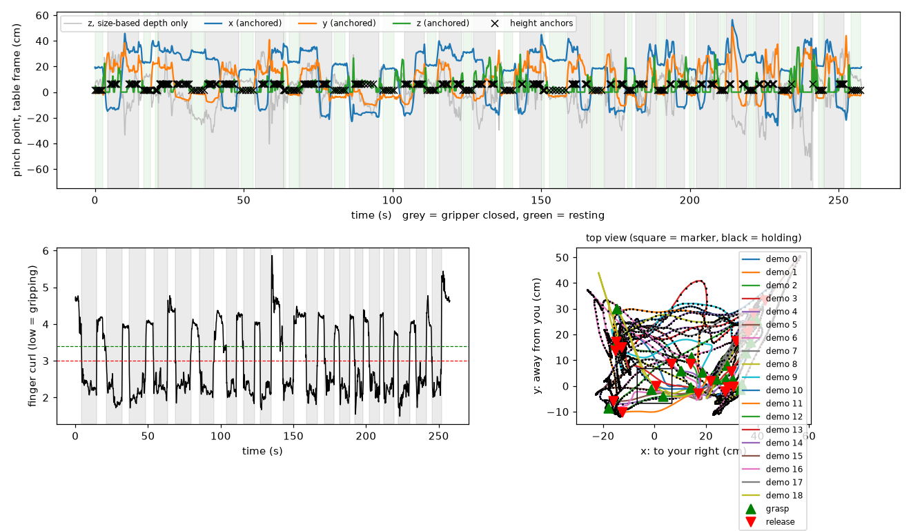

# ego2robot

I recorded my own hand putting a bowl on a plate with an iPhone, turned the video into
3D hand trajectories, replayed them on a simulated Franka Panda in new scenes, and used
the successful replays to fine-tune a vision-language-action model (SmolVLA)



*Left: my hand, filmed with an iPhone. Right: the same demo replayed on a Panda in a scene
with a different bowl and plate position*



*The fine-tuned SmolVLA policy on a scene it never saw during training (front, wrist and top cameras)*

## Results

| Stage | Result |
|---|---|
| Phone videos → hand demos | 20 demos (19 from one continuous take, 1 test) |
| Demos replayed on the robot, 10 random scenes each | **89%** (178 / 200) |
| SmolVLA fine-tuned on the 178 successful replays, 2000 steps | **32%** (16 / 50 unseen scenes) |
| Same, 5000 steps | **48%** (24 / 50 unseen scenes) |
| Same, 7000 steps | **42%** (21 / 50 unseen scenes) |
| Same, 10000 steps | **68%** (34 / 50 unseen scenes) |

Unseen scenes use random seeds that never appear in the training data. An episode counts as a
success when the bowl rests on the plate and the gripper has let go, within 500 steps (25 s).
With 50 scenes, one scene is 2 percentage points and the uncertainty is roughly ±7 points, so the
dip at 7000 steps is within noise; the jump to 68% at 10000 is not.
Raw numbers: [`outputs/replay_results.json`](outputs/replay_results.json),
[`outputs/eval_002000/results.json`](outputs/eval_002000/results.json),
[`outputs/eval_005000/results.json`](outputs/eval_005000/results.json),
[`outputs/eval_007000/results.json`](outputs/eval_007000/results.json),
[`outputs/eval_010000/results.json`](outputs/eval_010000/results.json).

## Pipeline

```
iPhone video ──► track_hand.py ──► extract_demos.py ──► sim/replay_demos.py ──► sim/to_lerobot.py ──► lerobot-train ──► sim/eval_policy.py
               marker + hand      3D pinch path +      retarget onto the       LeRobot dataset       SmolVLA (Colab T4)   50 unseen scenes
               per frame          open/close, 1 per    Panda in random         (3 cameras, state,
                                  demo                 scenes, keep successes  action)
```

**1. Recording.** An ArUco marker (13.5 cm, [`aruco_marker_13.5cm.pdf`](aruco_marker_13.5cm.pdf))
lies on the table and defines the table frame. The phone stands on a holder about 0.9 m away.
I did all demos in one continuous video, resting my open hand flat on the table between demos.

**2. Hand tracking** ([`track_hand.py`](track_hand.py)). Per frame: marker pose with
`solvePnP`, and 21 hand landmarks with MediaPipe. Detection rate on the main video: hand 98.6%,
marker 76.1% (the hand covers it during some grasps).

**3. Demo extraction** ([`extract_demos.py`](extract_demos.py)). One camera cannot measure
depth directly, so the 3D position of the pinch point comes from *anchored depth*:
- relative depth from PnP on the six rigid palm landmarks, which is right up to a slowly drifting scale;
- anchors where the true height is known: hand resting flat on the table (1.5 cm), and hand holding
  still while gripping the bowl rim (6.5 cm, the bowl is 7 cm tall). At an anchor, the pixel ray
  is intersected with that height plane, which fixes the scale; between anchors it is interpolated.

The grasp is detected from finger curl (fingertip-to-wrist distance divided by palm size, with
hysteresis). Rests (hand still and open for at least 0.5 s) split the video into demos.



**4. Retargeting to the robot** ([`sim/retarget.py`](sim/retarget.py),
[`sim/bowl_plate_env.py`](sim/bowl_plate_env.py)). A custom robosuite task: a Panda, a bowl and
a plate at random positions. Each human demo is split at the pick and the place moment, and
mapped object-centrically (the same idea as MimicGen, but starting from a human hand):
- approach: re-anchored so it ends on the simulated bowl rim;
- carry: the human path is decomposed into progress along pick→place, sideways deviation and lift,
  then mapped onto the simulated bowl→plate. Progress is forced to be monotonic and sideways
  deviation is capped, because depth noise can make the tracked hand jump backwards;
- retreat: re-anchored on the place point.

The arm follows the targets with the OSC_POSE controller at 20 Hz. It waits until it is within
1 cm before closing or opening the gripper, and never moves down while still more than 2 cm off
sideways.

**5. Policy** ([`notebooks/train_smolvla_colab.ipynb`](notebooks/train_smolvla_colab.ipynb)).
The 178 successful replays (59,871 frames) are converted to a LeRobot dataset with three 256×256
cameras, an 8-D state (end-effector position and axis-angle, 2 finger joints) and the 7-D
delta action. `lerobot/smolvla_base` is fine-tuned on a Colab T4 with batch size 16 for
10000 steps, about 2.7 passes over the data (the first 5000 on the free tier, the rest resumed
from the 5000-step checkpoint).

## How to run

Tested on macOS (M1), Python 3.12.

```bash
python3 -m venv .venv && source .venv/bin/activate
pip install -r requirements.txt

# 1-3: phone video -> demos (put your video in data/raw_videos/)
python track_hand.py data/raw_videos/session_01.MOV
python extract_demos.py data/processed/session_01

# 4: replay every demo in 10 random scenes; or render one side-by-side video
python -m sim.replay_demos --scenes 10
python -m sim.make_showcase --demo session_01/demo_00 --video data/raw_videos/session_01.MOV

# training data for the policy
python -m sim.replay_demos --scenes 10 --save data/sim_episodes
```

Training runs in Colab: zip `data/sim_episodes`, upload it to Google Drive and run
[`notebooks/train_smolvla_colab.ipynb`](notebooks/train_smolvla_colab.ipynb).

Evaluation runs locally on the Mac GPU, in a separate environment for LeRobot:

```bash
python3 -m venv .venv-lerobot && source .venv-lerobot/bin/activate
pip install "lerobot[smolvla]==0.6.1" robosuite==1.4.0 mujoco==3.8.1 termcolor numba "imageio[ffmpeg]"
# SmolVLA loads the VLM in bfloat16; switch it to float32 (needed on the T4 and on the Mac)
python -c "import lerobot, pathlib; p = pathlib.Path(lerobot.__file__).parent / 'policies/smolvla/smolvlm_with_expert.py'; p.write_text(p.read_text().replace('torch_dtype=\"bfloat16\"', 'torch_dtype=\"float32\"'))"

PYTORCH_ENABLE_MPS_FALLBACK=1 python -m sim.eval_policy checkpoints/smolvla_010000 --episodes 50 --videos 6 --out outputs/eval_010000
```